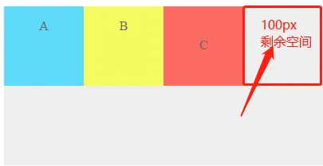

# Flex布局笔记

​		很早的时候大家都在使用传统的盒模型布局，但是目前已经是移动端市场的天下了，作为一名合格的前端工程师，使用更具备弹性的Flex布局是必要的，今天将彻底总结Flex布局相关技术。首先要说的是，当你学会了Flex布局，你将几乎可以解决需要的任何布局，话不多说开整。


## 名词

​		对于Flex布局里面有很多概念，第一步先按照协议约定去熟悉一些名词（有些名词代表的事情可能是你所曾理解的其他名字，但我们既然涉及到这个技术时就需要遵守名词的定义叫法，这个就叫专业）

​		**Flex**——弹性布局

​		**容器**（flex container）——使用flex布局的元素称为容器

​		**项目**（flex item）——在容器内的所有子元素称为项目（我们都知道是元素，但是以后改口就叫“项目”）


​		容器内存在两根轴，这就区别于盒模型（好好理解一下）分别为：

​		**主轴**（main axis）——默认情况下主轴是水平的

​		**交叉轴**（cross axis）——默认情况下交叉轴是垂直的


​		默认情况下容器内的项目沿着主轴方向排列。

## CSS属性

​		Flex的CSS属性分为两部分，一部分是作用在容器上的**容器属性**，还有一部分是作用在项目上**项目属性**。

### 容器属性

#### 1.display

​		首先要使用Flex布局，在容器的属性display必须设置为 flex 或 inline-flex。

​		块元素使用 flex；

​		内联元素使用 inline-flex；

​		在设置了 flex 后，项目的float、clear属性都将失效。

```css
.container {
    display:flex | inline-flex;
}
```

例子：

```html
<head>
    <style type="text/css">
    .container {
        display: flex;
        border: 1px black solid;
        width: 500px;
    }

    .item {
        width: 100px;
        height: 100px;
        background-color: paleturquoise;
        margin: 20px;
    }
    </style>
</head>
<div class="container">
    <div class="item">flex item</div>
    <div class="item">flex item</div>
    <div class="item">flex item</div>
</div>
```

效果图：


#### 2.flex-direction

​		flex_direction用于指定主轴的方向，默认为 row，水平方向。项目始终沿着主轴的方向排列。

```css
.container {
    flex-direction: row | row-reverse | column | column-reverse;
}
```

​		row——水平方向；

​		row-reverse——水平方向，但项目从右到左边排列，最右边是第一个项目，第一个项目紧贴容器的最右边；

​		column——垂直方向；

​		column-reverse——垂直方向，项目从下往上排列，最下面是第一个项目，第一个项目紧贴容器的最下边。

#### 3.flex-wrap

​		flex-wrap用于确定项目元素是否换行展示，当所有的项目在主轴（以水平方向主轴为例）的宽度之和超过了容器的宽度，通过flex-wrap来决定是否换行显示。

```css
.container {
    flex-wrap: no-wrap | wrap | wrap - reverse;
}
```

​		no-wrap（默认）——不换行，意味着若项目超出容器宽度，会自动缩小item的宽度；

​		wrap——换行，项目排列的宽度超过容器宽度时就会另起一行；

​		wrap-reverse——换行，会向上换行。

​		**在设置为no-wrap属性时，既然项目一行的总宽度已经超过了容器，意味着每一个项目都被直接或者间接的设置了width属性（有width才会溢出），此时会自动缩小item的宽度这就说明no-wrap对项目的宽度影响优先级是非常高的！**

​		此时我们做一个有趣的实验看下，若项目的宽度是不相等的，观察下会如何压缩？

```html
<head>
    <style type="text/css">
    .container {
        display: flex;
        border: 1px black solid;
        width: 300px;
    }
    .item1 {
        width: 50px;
        height: 100px;
        background-color: paleturquoise;
        margin: 20px;
    }
    .item2 {
        width: 100px;
        height: 100px;
        background-color: paleturquoise;
        margin: 20px;
    }
    .item3 {
        width: 150px;
        height: 100px;
        background-color: paleturquoise;
        margin: 20px;
    }
    </style>
</head>
<div class="container">
    <div class="item1">flex item 1</div>
    <div class="item2">flex item 2</div>
    <div class="item3">flex item 3</div>
</div>
```


​		结果就是，3个项目的总宽度不会超过容器，而3个项目被压缩后，仍然保持了原来的三者宽度的相对关系！

#### 4.flex-flow

​		flex-flow是对flex-direction与flex-wrap的缩写，例如：

```css
.container {
    flex-flow: column wrap;
}
```

#### 5.justify-content

​   justify-content用于指定item在主轴的对齐方式，item可沿主轴：

​	flex-start——开始方向对齐

​	flex-end——结束方向对齐

​	center——居中对齐

​	space-between——两端对齐（两两项目之间的间隔是相等的）

​	space-around——两侧对齐（指单个项目左右两侧的间隔是相等的，所以项目边缘的空隙是两个项目之前间隔的一半）

```css
.container {
    justify-content: flex-start;  //默认值
}
```


#### 6.align-item

align-item 定义了项目在交叉轴方向的对齐方式，同样有沿轴的开始方向（flex-start）对齐，结束方向对齐（flex-end）对齐和居中对齐（center）baseline和stretch。

```css
align-item:flex-start|flex-end|center|baseline|stretch
```

stretch 为默认值，如果项目没有设置高度或者高度为auto，那么项目的高度将被拉伸到占满整个容器的高度。前面的图因为给3个项目设置了相同的高度，所以stretch并不会生效。现在把项目的高度去掉，显式指定 align-items 为 stretch 。

```css
.container {
    align-items: stretch;
    height: 200px;
}

.item {
    width: 100px;
    background-color: paleturquoise;
    margin: 0 20px;
}
```


```css
.container {

    align-items: center;
    justify-content: center;
}
```

当给项目设置主轴和交叉轴的对齐方式都是center时，那么项目就可以同时在水平和垂直方向居中了。flex-end 和 flex-start 就不介绍了，自己试验看下效果就行。


#### 7.align-content

align-content 是指项目如果有多行时，在交叉轴的对齐方式

```css
.container {
    align-content: flex-start | flex-end | center | space-between | space-around | stretch;
}
```

这些属性值在前面都出现过，意义是一样的。你可以通过设置不同的值来看效果

总结一下容器下的几个属性

容器总共7个属性，除了display就6个，flex-flow 是 flex-drection 和 flex-wrap 的组合， 所以最后其实你要记住的属性就5个。flex-drection 指定主轴和交叉轴。flex-wrap 用于项目超出父容器时是否要换行，justfiy-content 是主轴的对齐方式，align-items 和 align-content 是项目在交叉轴方向的对齐方式，align-content只在多行时才生效。

### 项目属性

flex item 项目也有5个属性

- flex
    - flex-grow
    - flex-shrink
    - flex-basis
- order
- align-self

这5个属性是设置在项目中的属性， 当所有项目的宽度或高度之和在主轴或交叉轴方向还有很多**剩余空间**或者空间不足以装载这些子项目时，我们可以用这些属性通过拉伸或者压缩子项目来控制子项目，使之灵活实现弹性布局。

#### 剩余空间

什么是剩余空间呢？假设容器的宽度是400px， A、B、C3个子项目的宽度都100px， 他们的内外边距都为0，那么容器主轴方向的剩余空间是400-300=100px。



这剩余出来的100px空间我们可以通过拉伸项目来填满。

```html
<div class="container">
    <div class="item a">
        <p>A</p>
    </div>
    <div class="item b">
        <p>B</p>
    </div>
    <div class="item c">
        <p>C</p>
    </div>
</div>
```

```css
.container {
    background-color: #eee;
    display: flex;
    width:400px;
    height: 200px;
    text-align: center;
    color: #666;  
}

.item {
    height: 100px;
    
}

.a {
    width: 100px;
    background-color: #61dafb;
}


.b {
    width: 100px;
    background-color: #f5fb61;
}

.c {
    width: 100px;
    background-color: #fb6c61;
}
```

#### flex-grow

flex-grow 的默认值为0，子项目不进行任何比例的拉伸，如果将3个子项目的flex-grow属性都设置为1， 那么他们将按照1:1:1的比例来分配剩余的100px空间。每个子项目的宽度就有133.3px了。

```css
.item {
    flex-grow: 1;
}
```


如果只给A项目设置flex-grow的属性为1，其它两个默认为0， 他们的比例就是1:0:0，意味着所有的剩余空间都给了A，A就有200px了。

```css
.a {
    width: 100px;
    background-color: #61dafb;
    flex-grow: 1;
}
```


如果容器压根就没有剩余空间，那么即使你设置了flex-grow不会生效。

#### flex-shrink

当容器的空间不足以容纳子项目的空间时，要么选择换行，要么选择将项目进行压缩。flex-shrink 的默认值为1。

我将容器的宽度设置为200px， 3个子项目的宽度都是100px， 这时容器的宽度不足，默认情况下3个项目的宽度都进行等比例压缩，变成了66.67px。


如果不希望被压缩，我们可以选择换行，只要设置 flex-wrap 属性为 wrap 就好。


为什么C的长度是A和B的长度之和呢？因为 C 换行后独占一行，相当于在第二根主轴方向只有它，这时候你又设置了flex-grow的值，所有它会把所有剩余空间全部占满。

如果选择不换行对项目进行压缩的话，就可以使用flex-shrink 属性，数值越大，压缩越多。具体压缩多少呢？这个要看溢出的空间有多少。flex-shrink 为0时不压缩。

如果容器还有剩余空间，设置flex-shrink也是无效的。

#### flex-basis

flex-basis 表示项目在主轴的空间（flex-direction为row时就是项目的宽度），默认值是auto，即项目本来的宽度。计算主轴还有多少剩余空间就是用来这个属性来计算。

项目的实际宽度有个优先级：max-width/min-width > flex-basis > width > box， 意味着这些属性同时存在时，优先取 max-width和min-width。

flex-grow, flex-shrink 和 flex-basis 可以用一个flex属性将三个值组合在一起。

```css
.item {
    flex:0;
}
// 等价于
.item {
    flex-grow: 0;
    flex-shrink: 1;
    flex-basis: 0%;
}

.item {
    flex:1;
}
// 等价于

.item {
    flex-grow: 1;
    flex-shrink: 1;
    flex-basis: 0%;
}
```