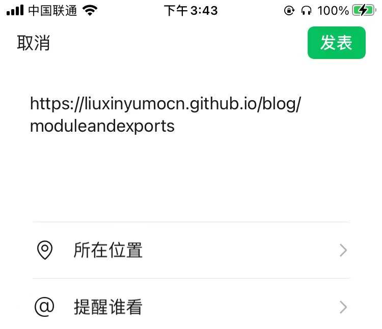
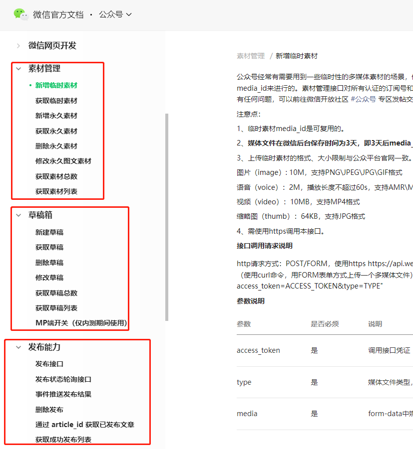
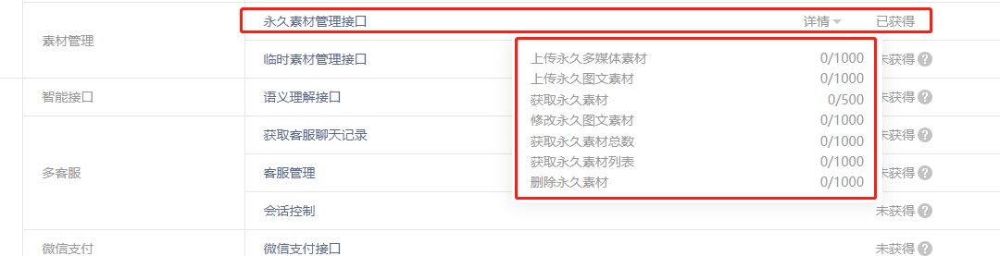

# 基于Node.js的Github文章同步微信公众号实战（持续更新）

作者：Nebula

邮箱：admin@liuxinyumo.cn

## 起因

本来想在Github Pages里开一个个人的blog，平时分享下技术，但是发现发布的文章并不能直接分享到公众号里，打开网页再点击分享后就变成了纯文字的朋友圈消息，这体验也太差了。一开始以为是微信只能分享公众号文章，不过发现部分的外链网站也是可以正常分享的，那大概就是分享策略问题了，必须是接入微信SDK的网页，配置了分享策略才能分享，然而Github Pages我无权干预这一项配置，所以我还在想难道要两边各写一份？谁料晚间的时候一篇“博客文章自动同步微信公众号实践”，这我可就来了兴趣，为什么我不实现一个基于Github的文章同步脚本？

简单预想了一下，这件事也不是一天两天能搞完的，先说明下这块内容持续更新，毕竟自己平时还是比较忙，理论问题应该不大，不会烂尾，朋友们可以跟踪一下。

文章地址：[https://liuxinyumocn.github.io/blog/page2mp](https://liuxinyumocn.github.io/blog/page2mp)

脚本仓库地址：[https://github.com/liuxinyumocn/page2mp](https://github.com/liuxinyumocn/page2mp)

## 可行性分析

首先Github Page这边其实就没什么可担心的，自然撰写并发布就行了，观察一下微信公众号侧的一些权限与限制。

首先微信公众号的开发文档中提供了 素材管理、草稿箱、发布能力 这几个API，我们正常使用这些能力就可以发布文章，不过这里还有一个未验证的能力就是，未认证的订阅号是否支持上述能力的调用？还有待验证，因为从接口权限表中我们只能知道永久素材是可以调用的，其他接口未说明是否开放。

抛开权限问题，我们还需要解决的是，我们的文章均采用MarkDown格式文档进行撰写，文档格式内容明显无法直接输出给公众号的文章系统，从接口中可以看到，公众号的文章API是支持HTML格式的正文输入，额外要注意的是，公众号的文章内的图片是不允许出现外链图片。而上面开放的能力中素材管理可以帮我们解决图片外链问题，所以我们的思路就很清晰了。

1. 先将图文分离，获取原始的图片资源
2. 将原始图片资源利用 **素材管理** API完成上传，获取微信提供的CDN图片资源URL
3. 替换步骤1中对应的原始图片资源地址，获得新的文章正文
4. 将新的文章正文（MarkDown文档格式）转换成HTML格式
5. 调用 **草稿箱** API完成草稿发布
6. 再对发布的草稿进行 **发布接口** API完成文章的发布

这里面我们可能额外要考虑一个问题，**access_token** 的存储问题，因为 **access_token** 是有创建上限以及过期机制的，如果在单节点服务器环境中，一般做一个本地的Cache就可以了，但是我们既然是要使用Github来撰写文章，同步到公众号来分享，很明显这是一个基于个人PC的应用场景，个人PC最大的特点是不确定的使用环境，那么这就很难合理的使用 **access_token** ，要么频繁申请（虽然对于个人来讲，2000/日的频率的确不需要考虑这个问题），但作为一个专业的博主，我当然是想在遇到一个问题是，直接给出终极的解决方案，省的将来出现诟病。为了发布文章还要配一台服务器，这肯定是不现实的，我给出的一种解决方案是：

将 **access_token** 存储到Github仓库内，当用户到其他PC时，自然就会自动同步 **access_token** ，然鹅 **access_token** 是涉及安全的秘钥，公开放到仓库中肯定是不允许的，因此我们就可以进行一个基于密码解密的秘钥获取方案，这个方案的安全性那就是从暴力破解的角度分析，有多少种组合能够试出来，组合足够多，一定程度上我们就认为是安全的了。